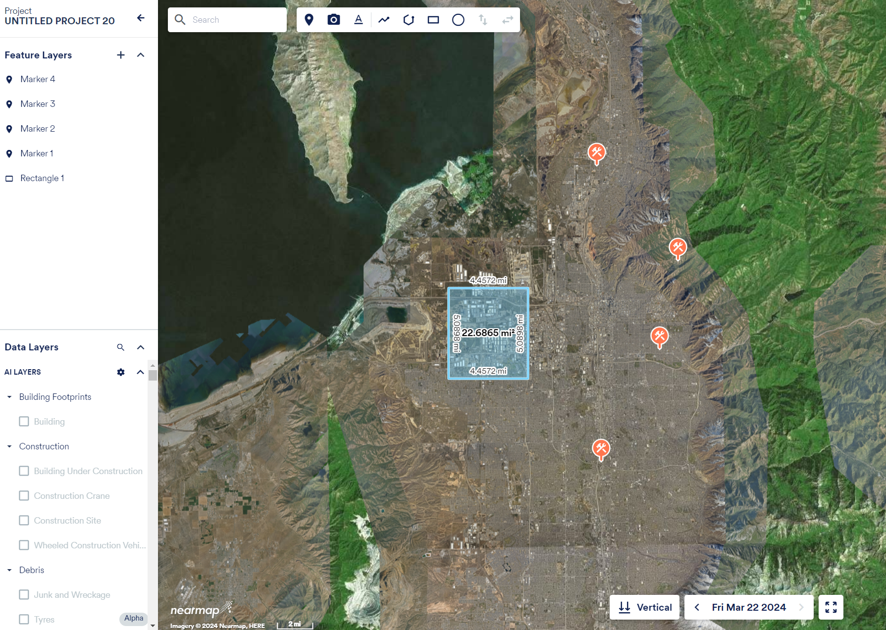
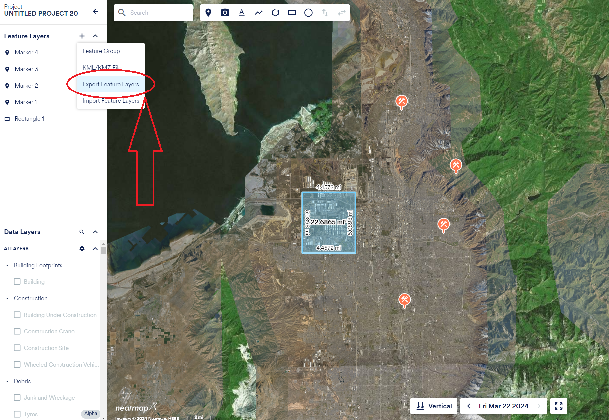
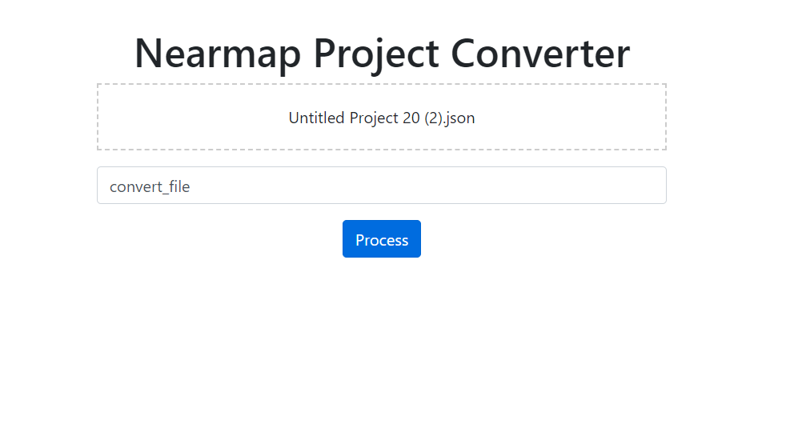

# Nearmap Exported Project File Convert to KML

## Table of Contents
- [Overview](#overview)
- [Features](#features)
- [Installation](#installation)
- [Usage Examples](#Usage)

## Overview
File Converter for Nearmap Project Files to convert to kml. Converts Nearmap mapbrowser "project files" which are proprietary json file formats meant to share annotations and markup data for use in Mapbrwoser.

## Features
- converts json to kml
- handles points lines and polygons

## Installation
### Prerequisites
- membership of Nearmap in order to leverage this converter with Mapbrowser. 

## Usage Examples

### Export Json from Mapbrowser

### Convert to KML with converter
 

### Use KML in GIS or Mapbrowser

